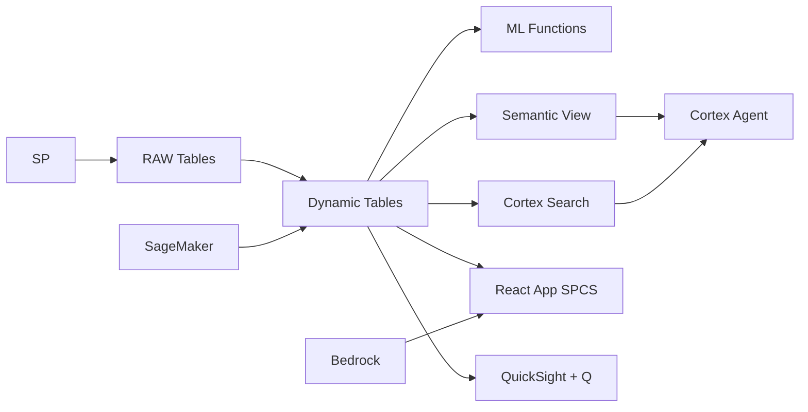

# Branch Network Optimization & Demand Forecasting

Philippine banks operate 12,000+ branches serving 55M banked Filipinos — Snowflake uses H3 geospatial + ST_WITHIN to identify underserved areas, ML.FORECAST to predict branch demand, and optimize branch network expansion.

## Architecture

Philippine banking is a tale of two markets: 55 million banked Filipinos clustered in NCR and Cebu, and 51 million unbanked across provinces. A mid-tier universal bank operates 850 branches but faces a strategic dilemma — 124 branches are losing money while 15 provinces have no bank presence at all. Geospatial intelligence with H3 and demand forecasting with ML.FORECAST reveals exactly where to expand, consolidate, or transform.



## Snowflake Capabilities

| Capability | Implementation |
|-----------|---------------|
| Dynamic Tables | BRANCH_PERFORMANCE / CATCHMENT_ANALYSIS / DEMAND_TIMESERIES / EXPANSION_CANDIDATES |
| ML Functions | ML.FORECAST + ML.CLASSIFICATION |
| Cortex AI | COMPLETE, AI_CLASSIFY |
| Cortex Search | 82 documents indexed |
| Cortex Agent | BRANCH_INTELLIGENCE_AGENT |
| Semantic View | BRANCH_NETWORK_ANALYTICS |
| React App (SPCS) | 5 tabs + DemoGuide |


## AWS Services

| Service | Role in Demo |
|---------|-------------|
| Amazon Location Service | Foot traffic patterns and geofencing around branches |
| Amazon SageMaker | Branch demand forecasting and viability scoring |
| Amazon Bedrock (Claude) | Generate branch expansion business case narratives |
| Amazon QuickSight + Q | Branch performance dashboard with map visualization |
| Amazon Redshift Spatial | Geospatial queries for catchment analysis |
| AWS Glue | ETL for population and competitor data |


## Personas

| Persona | Role | Key Questions |
|---------|------|---------------|
| **Conchita Maria Yuchengco** | EVP Branch Banking | "Which provinces are underserved relative to population?" "What's the projected ROI for the 20 proposed branches?" |
| **Alejandro Luis Aboitiz** | Network Planning Director | "What's the population density within 3km of our branches?" "Where do competitors have branches but we don't?" |


## Data

| Table | Rows | Description |
|-------|------|-------------|
| BRANCHES | 850 | Bank branch locations with performance data |
| COMPETITOR_BRANCHES | 4,200 | Major competitor branch locations (BDO, BPI, Metrobank, Landbank) |
| TRANSACTIONS | 12,000,000 | 6 months of branch transaction data |
| POPULATION_GRID | 45,000 | Population density by barangay with demographics |
| FOOT_TRAFFIC | 2,800,000 | Location Service foot traffic data near branches |
| BRANCH_FINANCIALS | 5,100 | Monthly branch P&L and productivity metrics |
| BSP_BANKING_DATA | 82 | BSP branch banking statistics by region |


## Build Instructions

### Prerequisites
- Snowflake account with ACCOUNTADMIN access
- Cortex AI enabled (ML Functions, Search, Agent)
- Warehouse: BRANCH_WH (Medium)
- AWS CLI with access (us-west-2)

### Deployment

```bash
snowsql -f snowflake/00_setup.sql
snowsql -f snowflake/01_marketplace_install.sql
snowsql -f snowflake/02_raw_tables.sql
snowsql -f snowflake/03_staging.sql
snowsql -f snowflake/04_dynamic_tables.sql
snowsql -f snowflake/05_search.sql
snowsql -f snowflake/06_ml_models.sql
snowsql -f snowflake/07_semantic_view.sql
snowsql -f snowflake/08_agent.sql
```

### React App (SPCS)
```bash
cd app && npm ci && npm run build
docker build -t aws-philippines-banking-branch-app .
docker push bdiqc8sm-default.registry.snowflakecomputing.com/branch_network/app/aws_philippines_banking_branch/app:latest
```

### Demo Mode
Open the app URL with `?demo=true` for presenter view.

## Build Modes

### Snowflake Only
Run scripts 00-08 (skip AWS-specific integration). Uses:
- **H3 geospatial + ST_WITHIN (native)** instead of Amazon Location Service
- **ML.FORECAST + ML.CLASSIFICATION (native)** instead of Amazon SageMaker
- **Cortex Complete** instead of Amazon Bedrock (Claude)
- **Snowflake Intelligence (Cortex Analyst)** instead of Amazon QuickSight + Q
- **H3 + ST_WITHIN + ST_DISTANCE (native geospatial)** instead of Amazon Redshift Spatial
- **Dynamic Tables (declarative pipelines)** instead of AWS Glue

### Full AWS + Snowflake
Run all scripts including AWS integration. Deploy QuickSight dashboard from `quicksight/`.

## Business Impact

Industry research and Snowflake customer outcomes:
- **Philippine banking sector assets reached ₱22.4 trillion in 2023** — [BSP](https://www.bsp.gov.ph/Statistics/banking.aspx)
- **51 million Filipino adults remain unbanked — largest financial inclusion gap in ASEAN** — [BSP Financial Inclusion Survey](https://www.bsp.gov.ph/Pages/InclusiveFinance/Financial-Inclusion.aspx)
- **Geospatial analytics improves branch location ROI by 30-50%** — [McKinsey Banking](https://www.mckinsey.com/industries/financial-services/our-insights)
- **Digital-first branch formats reduce operating costs 40-60% vs traditional branches** — [Deloitte Banking](https://www2.deloitte.com/global/en/pages/financial-services/articles/banking-industry-outlook.html)


## Key Demo Numbers

- **850 branches** serving 4.2M customers nationwide
- **124 branches** underperforming (negative ROI)
- **15 provinces** with 500K+ population and zero branch presence
- **16 of 20** proposed branches predicted profitable within 2 years
- **62%** of Filipino population within 5km of a bank branch
- **₱18M** average annual revenue per branch


## License

Apache 2.0 — See [LICENSE](LICENSE) for details.

This is a personal demo project and is not an official Snowflake offering. It comes with no support or warranty.